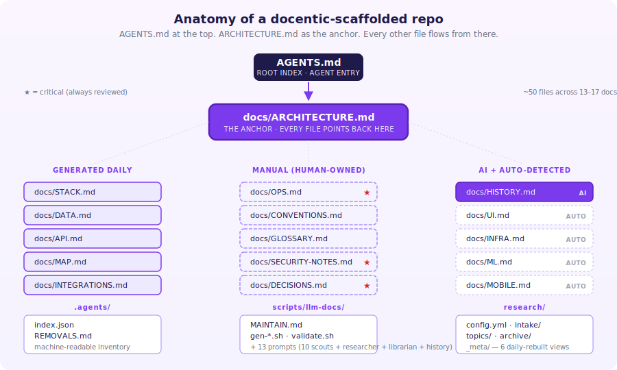
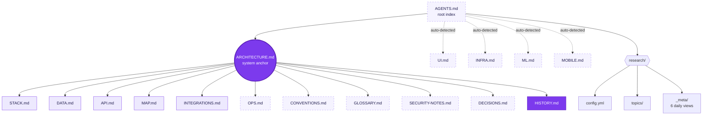

<p align="center">
  <picture>
    <source media="(prefers-color-scheme: dark)" srcset="./docs/assets/logo-dark.svg">
    
  </picture>
</p>

<h1 align="center">docent</h1>

<p align="center">
  <em>Your agent guide through any codebase.</em>
</p>

<p align="center">
  <a href="https://github.com/intrepideai/docent/releases"></a>
  <a href="https://github.com/intrepideai/docent/actions/workflows/ci.yml"></a>
  <a href="./LICENSE"></a>
  
</p>

<p align="center">
  <a href="#two-ways-to-start--pick-one-and-copy"><b>Quick start</b></a> ·
  <a href="#why"><b>Why</b></a> ·
  <a href="#what-you-get"><b>What you get</b></a> ·
  <a href="#commands"><b>Commands</b></a> ·
  <a href="./prompts/bootstrap.md"><b>Give to your AI</b></a>
</p>

---

**Make your repo agent-friendly in one command.**

`docent` scaffolds a standardized documentation spine into any codebase — so any AI agent (Claude, ChatGPT, Cursor, Codex, you-name-it) can land on the repo and immediately know where to look. No more grepping blindly. No more hallucinated paths.

> A docent guides visitors through a museum. `docent` does the same for your repo — for both humans and AI agents.

<p align="center">
  
</p>

---

## Three ways to start — pick one and copy

### 1. In your terminal

```bash
npx github:intrepideai/docent init
```

That commits a `docent/template-scaffold` branch and opens a PR (if `gh` is configured). ~50 files. Stack-aware auto-detection.

### 2. In any LLM chat (Claude · ChatGPT · Cursor · Codex · Gemini · …)

```text
Make the repo at <YOUR-REPO-PATH> agent-friendly using docent (https://github.com/intrepideai/docent).

1. cd to that path.
2. Run: npx github:intrepideai/docent init --no-pr
3. Read https://github.com/intrepideai/docent/blob/main/prompts/bootstrap.md and follow it — fill all the TODO markers in AGENTS.md and docs/*.md by reading the codebase.
4. Commit on a branch and open a PR titled "chore: populate docent scaffold with real content".

Begin.
```

Replace `<YOUR-REPO-PATH>` with your repo's path. Your agent runs scaffold + content fill + PR in one shot.

### 3. In your editor (Claude Code or Cursor)

```bash
# One-time install of the docent skill
npx github:intrepideai/docent install
```

Then in any Claude Code or Cursor chat:

> "docent this repo"

Your agent picks it up automatically — scaffolds, then offers to fill the content TODOs. Two messages, end-to-end.

### Bonus — full auto with an API key

```bash
echo "ANTHROPIC_API_KEY=sk-ant-..." > .env
npx github:intrepideai/docent init && npx github:intrepideai/docent populate
```

The scaffold + content fill done by the CLI itself. No chat, no prompts to paste. Costs ~$0.30 per repo.

---

## Why

Stock repos are unreadable to AI agents. README is for humans, intent lives in heads, and architectural decisions evaporate. Agents end up grepping the wrong file three times before giving up.

### Without docent

```text
You: "What's the data model?"
Agent: *greps for "model"*
        *finds 47 matches in node_modules*
        *hallucinates a schema*
```

### With docent

```text
You: "What's the data model?"
Agent: *reads AGENTS.md → docs/DATA.md*
        *quotes the actual Prisma schema with line numbers*
        *links back to ARCHITECTURE.md for context*
```

| Concern | Stock repo | With docent |
|---|---|---|
| Entry point | README.md (for humans) | `AGENTS.md` (for agents) |
| Architecture intent | In someone's head | `docs/ARCHITECTURE.md` (the anchor) |
| Data model | Scattered across migrations | `docs/DATA.md` (regenerated daily) |
| API surface | Greppable, sometimes | `docs/API.md` (regenerated daily) |
| Known decisions | Buried in PR threads | `docs/DECISIONS.md` (ADRs) |
| What changed lately | `git log` (verbose) | `docs/HISTORY.md` (curated) |
| External research | None | `research/` (compounds over time) |
| Update cycle | Manual, drifts | Automated via the `maintain-repo` skill |

The whole point: **same shape across every repo in your fleet**, so any agent (or human) lands somewhere new and instantly knows what to do.

---

## Full walkthrough

The two-line setup at the top handles 90% of repos. Here's the longer version with every option.

### 1. Install (or skip — use `npx`)

```bash
# Zero-install one-shot (recommended)
npx github:intrepideai/docent init

# Or install globally
npm install -g github:intrepideai/docent
docent init

# Or clone for development
git clone git@github.com:intrepideai/docent.git
cd docent && npm install && npm run build && npm link
```

### 2. Fill the content

The scaffold leaves TODO markers in `AGENTS.md` and `docs/*.md` — real content depends on your codebase. Two ways:

- **Manual mode** (any LLM, no API key): paste [`prompts/bootstrap.md`](./prompts/bootstrap.md) — or the shorter prompt from the [hero section](#two-ways-to-start--pick-one-and-copy) — into your agent of choice.
- **Automated mode** *(coming soon)*: copy [`.env.example`](./.env.example) → `.env`, add `ANTHROPIC_API_KEY` / `OPENAI_API_KEY` / `GEMINI_API_KEY`, then `docent populate`.

### 3. Schedule maintenance

Once content is filled, schedule the 5 daily-cadence agents (Scout, Researcher, Librarian, HISTORY Writer, Conflict Resolver) to point at the repo. The agents keep docs fresh, surface external research, and never silently overwrite human edits.

---

## What you get

The repo gains a **hub-and-spoke documentation graph**. `ARCHITECTURE.md` is the hub; everything else points back. Agents that lose context have a guaranteed re-orient path.



**Legend:** purple solid = generated daily · purple dashed = manual · solid filled = AI-maintained · `ARCHITECTURE.md` = the anchor.

<details>
<summary>Or as a raw file tree</summary>

```text
your-repo/
├── AGENTS.md                              Root index — every agent reads this first
├── .agents/
│   ├── index.json                         Machine-readable doc inventory
│   └── REMOVALS.md                        Permanent audit log of deletions
├── .claude/skills/maintain-repo/
│   └── SKILL.md                           Claude Code wrapper
├── scripts/llm-docs/
│   ├── MAINTAIN.md                        The orchestrator spec
│   ├── gen-*.sh                           Deterministic doc generators
│   ├── validate.sh, research.sh           Validators + research pipeline
│   └── prompts/                           Per-task agent prompts
├── docs/
│   ├── ARCHITECTURE.md                    THE ANCHOR — everything else points here
│   ├── STACK / DATA / API / MAP           Generated daily
│   ├── INTEGRATIONS / OPS                 Manual, critical
│   ├── CONVENTIONS / GLOSSARY             Manual, auto-merge after 24h
│   ├── SECURITY-NOTES / DECISIONS         Manual, critical (review required)
│   ├── HISTORY                            AI-maintained, auto-merge after 4h
│   └── UI / INFRA / ML / MOBILE           Auto-detected based on stack
└── research/
    ├── config.yml                         Topics & sources (one repo-specific file)
    ├── intake/                            Scout output queue
    ├── topics/                            Research files organized by topic
    └── _meta/                             6 daily-rebuilt views (digest, top, gaps, ...)
```

</details>

Stack detection automatically adds `UI.md` for frontends, `INFRA.md` for IaC repos, `ML.md` for ML, `MOBILE.md` for mobile.

---

## Commands

```text
docent init [path]              Scaffold the template into a repo
  --dry-run                     Show what would be created without writing
  --force                       Overwrite existing files
  --minimal                     Only infrastructure (skip docs/* skeletons)
  --no-pr                       Commit on a branch but don't open a PR
  --no-commit                   Just write files; no git operations
  --branch <name>               Custom branch name (default: docent/template-scaffold)

docent populate [path]          Fill scaffolded TODOs using an LLM
  --model <name>                Claude model (default: claude-sonnet-4-7)
  --max-cost <usd>              Abort if estimated cost exceeds this (default: 5)
  --no-pr                       Commit on a branch but don't open a PR
  --no-commit                   Apply edits without git operations
  --branch <name>               Custom branch name (default: docent/populate-content)
  --dry-run                     Gather context + estimate cost without calling the API

docent check [path]             Validate a docent-scaffolded repo (no writes)
  --json                        Output JSON instead of text (for tooling)
  --warnings-as-errors          Fail on warnings — strict CI mode

docent install                  Install the docent skill into Claude Code and/or Cursor
  --claude                      Install only the Claude Code skill
  --cursor                      Install only the Cursor rule
  --project <path>              For Cursor: install per-project instead of globally
  --force                       Overwrite if already installed
  --dry-run                     Show what would be installed without writing
```

Exit codes for `docent check`: `0` healthy · `1` errors found · `2` not a docent repo.

Coming soon:
- `docent status` — show template state for a repo
- `docent update` — re-sync the template after a new docent release

---

## Editor install (Claude Code · Cursor)

For deeper detail on the editor skill — manual install paths, what triggers it, what it does — see the [installation guide](#three-ways-to-start--pick-one-and-copy) at the top, plus the source files: [`skills/claude/SKILL.md`](./skills/claude/SKILL.md) · [`skills/cursor/docent.mdc`](./skills/cursor/docent.mdc).

---

## Use it in CI

Drop this into `.github/workflows/docent.yml` to fail PRs that break the scaffold (broken `.agents/index.json`, missing spine files, schema violations):

```yaml
name: docent check
on:
  pull_request:
  push:
    branches: [main]

jobs:
  docent-check:
    runs-on: ubuntu-latest
    steps:
      - uses: actions/checkout@v4
      - uses: intrepideai/docent@main
```

Inputs (all optional):

```yaml
- uses: intrepideai/docent@main
  with:
    path: '.'                     # repo path to check (default: workspace root)
    warnings-as-errors: 'true'    # fail on warnings too (default: false)
    json: 'false'                 # output JSON for piping (default: false)
    node-version: '22'            # Node version to install (default: 22)
```

Pin to a tag for stability once we publish releases (e.g. `intrepideai/docent@v0.1.0`). Until then `@main` tracks the latest.

---

## Schemas (for tools and IDEs)

`.agents/index.json` ships with a JSON Schema. The scaffolded template includes a `$schema` reference, so editors with JSON Schema support (VS Code, Cursor, etc.) get autocomplete + validation out of the box.

Schema URL: <https://raw.githubusercontent.com/intrepideai/docent/main/schemas/agents-index.schema.json>

To validate by hand:

```bash
# Using ajv-cli
npx -y ajv-cli validate \
  -s https://raw.githubusercontent.com/intrepideai/docent/main/schemas/agents-index.schema.json \
  -d .agents/index.json
```

Or just run `docent check` — it does this validation built-in.

---

## How it fits with agents

`docent` handles **scaffolding** only. Day-to-day maintenance — refreshing generated docs, surfacing research, updating HISTORY — runs as a separate agent loop you schedule externally (Claude Desktop tasks, cron + a harness, your platform of choice).

Prompts split by job:
- [`prompts/bootstrap.md`](./prompts/bootstrap.md) — one-shot content fill (after `docent init`)
- [`prompts/config-seeder.md`](./prompts/config-seeder.md) — propose tailored `research/config.yml`
- Daily maintenance (Scout / Researcher / Librarian / HISTORY Writer / Conflict Resolver) — see Intrepide's orchestrator library

---

## Configuration

### `.env` (for `docent populate`, coming soon)

Copy [`.env.example`](./.env.example) to `.env` and fill in one of:

| Provider | Var | Notes |
|---|---|---|
| Anthropic (default) | `ANTHROPIC_API_KEY` | Recommended — Claude has the best repo-reasoning we've tested |
| OpenAI | `OPENAI_API_KEY` | |
| Google | `GEMINI_API_KEY` | |

`docent init` itself needs no API keys — it's pure scaffolding.

### `research/config.yml` (per-repo)

The one file that's truly repo-specific. Topics, keywords, sources, cadence. Run [`prompts/config-seeder.md`](./prompts/config-seeder.md) to get a tailored proposal based on your codebase.

---

## Design principles

1. **Hub-and-spoke docs.** Every file points back to `ARCHITECTURE.md`. Agents that lose context have a guaranteed re-orient path.
2. **Three content tiers.** `generated` (deterministic), `manual` (human-owned), `ai` (narrow agent updates with `NO_UPDATE_NEEDED` exit).
3. **Hash-based safety.** Generated files have a `generated_hash` stored. Manual edits trigger a conflict PR instead of being silently overwritten.
4. **Lean over comprehensive.** Spec files orient and summarize; heavy data stays in code, configs, vendor docs. Less drift.
5. **Critical files always reviewed.** `AGENTS.md`, `ARCHITECTURE.md`, `OPS.md`, `SECURITY-NOTES.md`, `DECISIONS.md` never auto-merge.

---

## Show your repo is agent-friendly

If you've scaffolded `docent`, add the badge to your README so other agents and humans know:

```markdown
[](https://github.com/intrepideai/docent)
```

Renders as: 

---

## Local development

```bash
git clone git@github.com:intrepideai/docent.git
cd docent
npm install
npm run dev -- init /path/to/test/repo --dry-run    # iterate
npm run build && npm link                            # try the binary
```

CI ([`.github/workflows/ci.yml`](./.github/workflows/ci.yml)) typechecks + runs two smoke tests on every PR.

---

## Contributing

Contributions welcome — `docent` is a tiny tool with a tight scope, so PRs that fit are easy to land.

- Read [CONTRIBUTING.md](./CONTRIBUTING.md) for setup, scope, and PR conventions
- See [SECURITY.md](./SECURITY.md) to report a vulnerability privately
- By participating you agree to the [Code of Conduct](./CODE_OF_CONDUCT.md)
- Notable changes are tracked in [CHANGELOG.md](./CHANGELOG.md)

Star the repo if `docent` is useful — it genuinely helps with discoverability.

---

## License

[Apache License 2.0](./LICENSE). Use it commercially, fork it, modify it, redistribute it — just keep the license + notice files intact.

Copyright © 2026 Intrepide.

---

<p align="center">
  Made by <a href="https://github.com/intrepideai">Intrepide</a>. Built for any agent, any LLM, any codebase.
</p>

<p align="center">
  <a href="https://star-history.com/#intrepideai/docent&Date">
    
  </a>
</p>
